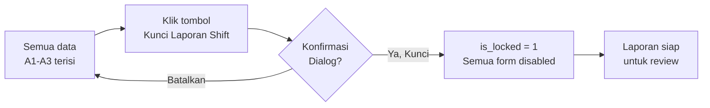
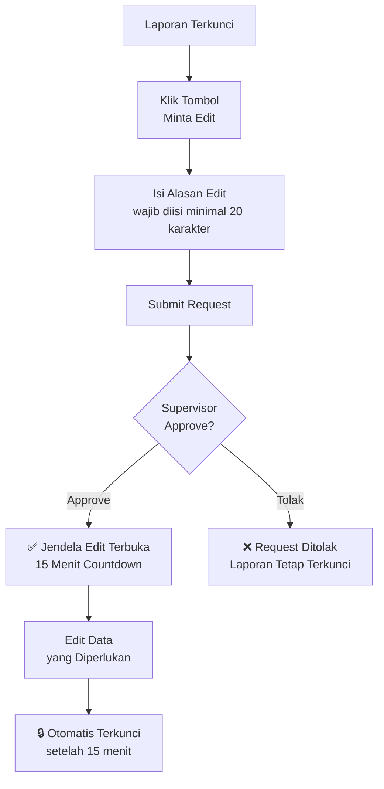
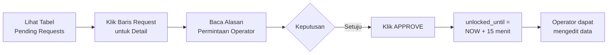
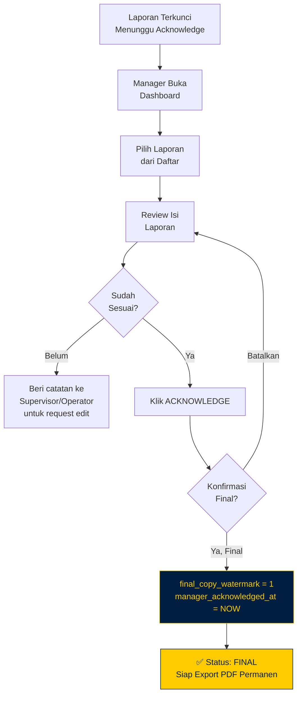

<div align="center">

# 📖 Panduan Pengguna — VTS OPS-LOG Palembang

**Versi 1.0 · April 2026**

> Dokumen ini menjelaskan tata cara penggunaan sistem VTS OPS-LOG Palembang secara lengkap untuk semua peran pengguna: **Operator**, **Supervisor**, dan **Manager**.

[🏠 Kembali ke README](README.md)

</div>

---

## Daftar Isi

1. [Gambaran Umum Sistem](#1-gambaran-umum-sistem)
2. [Cara Login](#2-cara-login)
3. [Panduan Operator](#3-panduan-operator)
   - [3.1 Dashboard Operator](#31-dashboard-operator)
   - [3.2 Form A1 — VTS Log](#32-form-a1--vts-log)
   - [3.3 Form A2 — Lalu Lintas Kapal](#33-form-a2--lalu-lintas-kapal)
   - [3.4 Form A3 — Laporan Cuaca](#34-form-a3--laporan-cuaca)
   - [3.5 Form A5 — Pra-Kedatangan](#35-form-a5--pra-kedatangan)
   - [3.6 Form A6 — Laporan Insiden](#36-form-a6--laporan-insiden)
   - [3.7 Form A7 — Operasi Khusus](#37-form-a7--operasi-khusus)
   - [3.8 Form A8 — Pelanggaran Berlayar](#38-form-a8--pelanggaran-berlayar)
   - [3.9 Mengunci Laporan Shift](#39-mengunci-laporan-shift)
   - [3.10 Meminta Izin Edit](#310-meminta-izin-edit)
   - [3.11 Export PDF Laporan](#311-export-pdf-laporan)
4. [Panduan Supervisor](#4-panduan-supervisor)
   - [4.1 Dashboard Supervisor](#41-dashboard-supervisor)
   - [4.2 Menyetujui Edit Request](#42-menyetujui-edit-request)
   - [4.3 Menolak Edit Request](#43-menolak-edit-request)
   - [4.4 Melihat Audit Log](#44-melihat-audit-log)
5. [Panduan Manager](#5-panduan-manager)
   - [5.1 Dashboard Manager](#51-dashboard-manager)
   - [5.2 Acknowledge Laporan Final](#52-acknowledge-laporan-final)
   - [5.3 Membuat Akun Pengguna Baru](#53-membuat-akun-pengguna-baru)
   - [5.4 Melihat Semua Audit Log](#54-melihat-semua-audit-log)
6. [Aturan Shift Guard](#6-aturan-shift-guard)
7. [Status Laporan & Ikon](#7-status-laporan--ikon)
8. [Troubleshooting](#8-troubleshooting)
9. [Referensi Cepat](#9-referensi-cepat)

---

## 1. Gambaran Umum Sistem

VTS OPS-LOG adalah sistem pencatatan operasional digital yang menggantikan buku log manual harian **Vessel Traffic Service Palembang**. Sistem ini mencakup delapan formulir standar SOP (A1–A8) dengan kontrol penguncian laporan, alur persetujuan edit, dan ekspor PDF berstandar pengarsipan.

### Peran Pengguna

| Peran | Akses Utama | Keterangan |
|-------|-------------|------------|
| **Operator** | Dashboard Operator | Mengisi semua form A1–A8, mengunci shift, meminta edit |
| **Supervisor** | Dashboard Supervisor | Menyetujui/menolak permintaan edit, review laporan |
| **Manager** | Dashboard Manager | Finalisasi laporan (acknowledge), buat akun, audit penuh |

### Hierarki Status Laporan

```
[ Aktif / Bisa Diedit ]
        ↓  Operator kunci shift
[ Terkunci (is_locked = 1) ]
        ↓  Operator minta edit → Supervisor approve
[ Terbuka Sementara (max 15 menit) ]
        ↓  Kunci ulang otomatis
[ Terkunci — Menunggu Acknowledge ]
        ↓  Manager acknowledge
[ FINAL (final_copy_watermark = 1) ]
           ← TIDAK DAPAT DIUBAH LAGI
```

---

## 2. Cara Login

### Langkah-langkah Login

```
  ┌─────────────────────────────────────────────┐
  │          MASUK SISTEM — VTS PALEMBANG        │
  │                                             │
  │  Nomor Induk Pegawai (NIP)                  │
  │  ┌─────────────────────────────────────┐    │
  │  │  199001030001                       │    │
  │  └─────────────────────────────────────┘    │
  │                                             │
  │  Kata Sandi                                 │
  │  ┌─────────────────────────────────────┐    │
  │  │  ••••••••••                         │    │
  │  └─────────────────────────────────────┘    │
  │                                             │
  │  [ MASUK SISTEM ]                           │
  └─────────────────────────────────────────────┘
```

1. Buka browser dan akses `http://localhost:8000` (atau sesuai alamat server yang diberikan admin).
2. Masukkan **NIP** (Nomor Induk Pegawai) di kolom pertama.
3. Masukkan **Kata Sandi** di kolom kedua. Tekan ikon mata untuk menampilkan/menyembunyikan.
4. Klik tombol **"Masuk Sistem"**.

Setelah login berhasil:
- **Operator** → diarahkan ke Dashboard Operator
- **Supervisor** → diarahkan ke Dashboard Supervisor
- **Manager** → diarahkan ke Dashboard Manager

### Akun Default (untuk testing/setup awal)

| Peran | NIP | Password |
|-------|-----|----------|
| Supervisor | `198001010001` | `Supervisor123` |
| Manager | `197901020001` | `Manager123` |
| Operator (Tim A) | `199001030001` | `Operator123` |

> ⚠️ **Segera ganti password default** setelah sistem digunakan di lingkungan produksi.

### Pesan Error Login

| Pesan | Penyebab | Solusi |
|-------|----------|--------|
| "NIP atau kata sandi salah" | NIP/password tidak cocok | Periksa kembali NIP dan password |
| "Akun tidak aktif" | Akun dinonaktifkan oleh Manager | Hubungi Manager/Admin |
| "Shift tidak aktif" | Login di luar jam shift | Lihat [Aturan Shift Guard](#6-aturan-shift-guard) |

---

## 3. Panduan Operator

### 3.1 Dashboard Operator

Setelah login, Operator akan melihat **Dashboard Maritime Command** dengan komponen:

| Area | Konten |
|------|--------|
| **Sidebar kiri** | Navigasi tab: VTS Log, Lalu Lintas, Cuaca, Laporan, dan tombol Cetak PDF |
| **Header atas** | Nama pengguna, NIP, shift aktif, dan timer countdown |
| **Area utama** | Form tab sesuai pilihan sidebar |
| **Status Badge** | `AKTIF` (kuning) saat shift bisa diedit · `TERKUNCI` (merah) saat locked |

#### Indikator Shift

- **Timer berwarna kuning** di header = shift masih aktif, data dapat ditulis
- **Badge LOCKED** = laporan sudah dikunci, form dinonaktifkan
- **Timer hitung mundur** = jendela edit sementara sedang berjalan (dari grant Supervisor)

---

### 3.2 Form A1 — VTS Log

Form A1 adalah catatan kronologis semua komunikasi dan aktivitas pemantauan kapal selama shift.

#### Cara Mengisi

```
Formulir A1 — VTS Log
┌──────────────┬──────────────┬──────────────┬──────────────┐
│ Waktu Log    │ Nama Kapal   │ Call Sign    │ Aktivitas*   │
│ 14:25        │ KM SERASI    │ PKS-3201     │ VHF ch16...  │
├──────────────┼──────────────┼──────────────┼──────────────┤
│ Lokasi       │ Status       │ Catatan                     │
│ 02°41'S...   │ Aman         │ Kapal menuju Boom Baru      │
└──────────────┴──────────────┴──────────────┴──────────────┘
                                          [ + Tambah Log ]
```

| Kolom | Wajib | Keterangan |
|-------|-------|------------|
| **Waktu Log** | ✅ | Format `HH:MM` — waktu saat kejadian/komunikasi |
| **Nama Kapal** | — | Nama kapal sesuai AIS / komunikasi radio |
| **Call Sign** | — | Tanda panggil radio kapal (contoh: `YDA-4521`) |
| **Aktivitas** | ✅ | Deskripsi singkat aktivitas (maks 180 karakter) |
| **Lokasi** | — | Posisi kapal: koordinat GPS atau nama lokasi |
| **Status** | — | Status kondisi: Aman, Waspada, Darurat, dll. |
| **Catatan** | — | Informasi tambahan yang relevan |

#### Tips Pengisian A1

- Catat **setiap** komunikasi radio yang masuk maupun keluar.
- Gunakan format waktu **WIB (UTC+7)**.
- Untuk kapal yang sama dengan aktivitas berbeda, buat baris terpisah.
- Setiap baris disimpan secara independen — tidak perlu simpan semua sekaligus.

---

### 3.3 Form A2 — Lalu Lintas Kapal

Form A2 mencatat pergerakan kapal masuk, keluar, dan transit dengan detail lengkap.

#### Cara Mengisi

```
Formulir A2 — Lalu Lintas Kapal
[ + Tambah Baris Kapal ]

  Baris #1
  ┌─────────────┬──────────┬────────────┬────────────┐
  │ Nama Kapal* │ Call Sign│ Port Asal  │ Port Tujuan│
  │ KM LAWIT    │ YDA-1234 │ Tg. Priok  │ Boom Baru  │
  ├─────────────┼──────────┼────────────┼────────────┤
  │ ETD         │ ETA      │ Tipe Kapal │ Agen       │
  │ 2026-04-09  │ 2026-04-10│ Kargo     │ PT Samudera│
  │ 08:00       │ 06:00    │            │            │
  ├─────────────┼──────────┼────────────┼────────────┤
  │ Arah*       │ Waktu Sandar│ Waktu Labuh│ Berangkat │
  │ ● Inbound   │ 06:15    │ —          │ —          │
  └─────────────┴──────────┴────────────┴────────────┘
  [ Simpan Baris Ini ] [ Hapus ]
```

| Kolom | Wajib | Keterangan |
|-------|-------|------------|
| **Nama Kapal** | ✅ | Nama resmi kapal |
| **Arah** | ✅ | `Inbound` (masuk) / `Outbound` (keluar) / `Transit` |
| **ETD** | — | Waktu keberangkatan dari port asal (perkiraan) |
| **ETA** | — | Waktu tiba di area VTS (perkiraan) |
| **Waktu Sandar** | — | `alongside_time` — isi bila kapal sandar |
| **Waktu Labuh** | — | `anchor_time` — isi bila kapal lego jangkar |
| **Waktu Berangkat** | — | `depart_time` — isi setelah kapal bertolak |

#### Menambah Beberapa Kapal

Klik **"+ Tambah Baris Kapal"** untuk menambah baris baru. Setiap baris disimpan secara terpisah dengan tombol **"Simpan Baris Ini"**.

---

### 3.4 Form A3 — Laporan Cuaca

Form A3 mengisi kondisi cuaca untuk **11 area maritim** sekaligus dalam satu sesi.

#### Area Maritim yang Dicakup

| No | Area | Lokasi |
|----|------|--------|
| 1 | Ambang Luar | Muara Sungai Musi |
| 2 | Boom Baru | Pelabuhan Boom Baru |
| 3 | Boom Baru Hulu | Hulu Boom Baru |
| 4 | Kertapati | Dermaga Kertapati |
| 5 | Pulau Rimau | Perairan P. Rimau |
| 6 | Selat Bangka | Selat Bangka Utara/Selatan |
| 7 | Perairan Banyuasin | Sungai Banyuasin |
| 8 | Tanjung Api-Api | Pelabuhan Tanjung Api-Api |
| 9 | Perairan Upang | Wilayah Upang |
| 10 | Perairan Saleh | Perairan Selat Saleh |
| 11 | Perairan Bangka Barat | Bangka Barat |

#### Cara Mengisi

Untuk setiap area, isi kolom:

| Kolom | Pilihan |
|-------|---------|
| **Kondisi Cuaca** | Cerah / Berawan / Hujan Ringan / Hujan Lebat / Badai |
| **Arah Angin** | N, NE, E, SE, S, SW, W, NW |
| **Kecepatan Angin** | Dalam knot (desimal diperbolehkan, contoh: `12.5`) |
| **Tinggi Gelombang** | Dalam meter (contoh: `0.5`, `1.2`) |
| **Kategori Gelombang** | Tenang / Rendah / Sedang / Tinggi / Sangat Tinggi |

> 📌 Isi semua 11 area dalam satu kali sesi, lalu klik **"Simpan Data Cuaca"**. Data cuaca hanya bisa disimpan sekali per shift kecuali ada izin edit.

---

### 3.5 Form A5 — Pra-Kedatangan

Form A5 diisi saat ada kapal yang akan memasuki area VTS dan memerlukan persiapan khusus.

> ✅ **Bersifat opsional** — hanya isi jika ada notifikasi pra-kedatangan yang perlu dicatat.

#### Cara Mengisi

| Kolom | Wajib | Keterangan |
|-------|-------|------------|
| **Nama Kapal** | ✅ | Nama kapal yang akan tiba |
| **Nomor IMO** | — | Contoh: `IMO 9876543` |
| **Gross Tonnage** | — | Tonase kotor dalam GT, contoh: `5420.00` |
| **LOA (meter)** | — | Panjang total kapal, contoh: `142.5` |
| **Draft (meter)** | — | Contoh: `6.8` (penting untuk selat dangkal) |
| **Jumlah POB** | — | Jumlah orang di atas kapal |
| **ETA** | ✅ | Tanggal dan jam tiba di area VTS |
| **Detail Muatan** | — | Jenis muatan, berat, kode B3 jika bahan berbahaya |
| **Catatan Khusus** | — | Kebutuhan pandu, kondisi darurat, permintaan khusus |

#### Kapan Mengisi A5?

- Kapal di atas 500 GT yang akan memasuki alur Sungai Musi
- Kapal yang membawa bahan berbahaya (B3)
- Kapal dengan kondisi khusus (kandas sebelumnya, mesin tidak normal)
- Kapal yang memerlukan jasa pandu wajib

---

### 3.6 Form A6 — Laporan Insiden

Form A6 untuk mencatat kejadian tidak normal yang terjadi di wilayah pantauan VTS.

> ⚠️ **Penting:** Setiap insiden yang dicatat **wajib dilaporkan** ke rantai komando dan dilampirkan dalam PDF laporan shift.

#### Jenis Insiden yang Perlu Dicatat

- Tabrakan kapal (collision)
- Kandas (grounding)
- Kebakaran di atas kapal
- Orang jatuh ke laut (MOB — Man Over Board)
- Tumpahan minyak atau B3
- Operasi SAR
- Gangguan navigasi (bouy hilang, AIDS rusak)

#### Cara Mengisi

| Kolom | Wajib | Keterangan |
|-------|-------|------------|
| **Waktu Insiden** | ✅ | Tanggal + jam kejadian |
| **Judul Insiden** | ✅ | Ringkasan singkat, maks 160 karakter |
| **Kronologi** | ✅ | Narasi lengkap urutan kejadian |
| **Korban Jiwa** | — | Isi `0` jika tidak ada |
| **Orang Hilang** | — | Isi `0` jika tidak ada |
| **Lokasi Pencemaran** | — | Isi hanya jika ada tumpahan |
| **Instansi Dihubungi** | — | Pilih dari: KSOP, Basarnas, KLHK, Polairud, TNI AL |
| **Tindakan Segera** | ✅ | Jelaskan langkah yang sudah diambil VTS |

---

### 3.7 Form A7 — Operasi Khusus

Form A7 mencatat operasi non-rutin yang melibatkan otoritas militer atau sipil di wilayah VTS.

> ✅ **Bersifat opsional** — satu shift dapat memiliki lebih dari satu operasi khusus.

#### Contoh Operasi Khusus yang Dicatat

- Operasi patroli TNI AL / Bakamla
- Latihan gabungan militer
- Operasi SAR terkoordinasi
- Penegakan hukum Polair
- Survey hidro-oseanografi

#### Cara Mengisi

| Kolom | Wajib | Keterangan |
|-------|-------|------------|
| **Nama Operasi** | ✅ | Nama/kode operasi, contoh: `Ops Trisila 2026-IV` |
| **Waktu Mulai** | ✅ | Tanggal + jam awal operasi |
| **Waktu Selesai** | — | Kosongkan jika operasi masih berlangsung |
| **Lokasi** | ✅ | Koordinat GPS atau nama perairan |
| **Detail Operasi** | ✅ | Deskripsi tujuan, aset yang terlibat, prosedur |
| **Hasil Operasi** | — | Pencapaian, temuan, eskalasi jika ada |

---

### 3.8 Form A8 — Pelanggaran Berlayar

Form A8 untuk mencatat pelanggaran peraturan berlayar oleh kapal di wilayah VTS Palembang.

#### Jenis Pelanggaran Umum

- Melintas tanpa melapor ke VTS
- Kecepatan berlebih di alur sempit
- Berlabuh di zona larangan
- Tidak menggunakan VHF Channel 16
- Navigasi tanpa lampu malam hari
- Kapal tidak beridentitas (tanpa AIS)

#### Cara Mengisi

| Kolom | Wajib | Keterangan |
|-------|-------|------------|
| **Nama Kapal** | ✅ | Nama kapal yang melanggar |
| **Jenis Pelanggaran** | ✅ | Deskripsi singkat pelanggaran |
| **Waktu Kejadian** | ✅ | Tanggal + jam pelanggaran terdeteksi |
| **Lokasi** | ✅ | Koordinat atau nama area |
| **Jenis Teguran** | ✅ | Peringatan Lisan / Tertulis / Laporan ke KSOP |
| **Tindakan Diambil** | ✅ | Uraian lengkap respons VTS |
| **Dasar Hukum** | — | Contoh: `PM 57/2015 Pasal 12 ayat 3` |

---

### 3.9 Mengunci Laporan Shift

Setelah semua data shift terisi, Operator **wajib mengunci** laporan sebelum shift berakhir.

#### Flowchart Penguncian



#### Langkah-langkah

1. Pastikan semua data penting sudah tersimpan (A1, A2, A3 minimal).
2. Klik tombol **"Kunci Laporan Shift"** (tombol oranye/merah di sidebar atau header).
3. Akan muncul dialog konfirmasi — baca baik-baik sebelum mengkonfirmasi.
4. Klik **"Ya, Kunci Sekarang"**.
5. Sistem akan mengunci laporan — semua form berubah menjadi *read-only*.

> ⚠️ **Peringatan:** Setelah dikunci, data tidak dapat diedit secara langsung. Gunakan alur Request Edit jika diperlukan perubahan.

---

### 3.10 Meminta Izin Edit

Jika ada data yang perlu dikoreksi setelah shift dikunci:



#### Langkah-langkah

1. Dari dashboard (laporan sudah terkunci), klik **"Minta Edit"**.
2. Isi kolom **Alasan Permintaan Edit** — jelaskan dengan detail apa yang perlu dikoreksi.
3. Klik **"Kirim Permintaan"**.
4. Tunggu notifikasi dari Supervisor (biasanya dalam beberapa menit).
5. Jika disetujui, **timer 15 menit** akan muncul di header — segera lakukan perubahan.
6. Setelah 15 menit atau jika Anda mengkunci ulang, laporan akan terkunci kembali secara otomatis.

> 📌 Anda dapat melihat status request di dashboard (pending / approved / rejected).

---

### 3.11 Export PDF Laporan

Tombol **"Cetak PDF"** tersedia **hanya saat laporan sudah dikunci** (`is_locked = 1`).

#### Cara Mencetak PDF

1. Pastikan laporan shift sudah **dikunci** (badge LOCKED tampil di dashboard).
2. Klik tombol **"Cetak PDF"** berwarna emas di sidebar atau header.
3. Browser akan membuka tab baru dengan PDF laporan.
4. Gunakan **Ctrl+P** (Windows) atau fitur print browser untuk mencetak atau menyimpan sebagai PDF.

#### Isi Laporan PDF

| Halaman | Konten |
|---------|--------|
| Cover | Logo VTS + Kemhub, nama shift, tanggal, operator, QR code verifikasi |
| Halaman 1 | Form A1 — Tabel VTS Log lengkap |
| Halaman 2 | Form A2 — Tabel Lalu Lintas Kapal |
| Halaman 3 | Form A3 — Grid Cuaca 11 Area Maritim |
| Lampiran | A5–A8 (hanya jika ada data yang diisi pada shift tersebut) |
| Penutup | Tanda tangan Supervisor + Manager |

> ✅ Jika laporan sudah **final** (Manager acknowledge), QR code verifikasi akan tercetak di sudut kanan atas cover.

---

## 4. Panduan Supervisor

### 4.1 Dashboard Supervisor

Dashboard Supervisor menampilkan daftar **Edit Request yang menunggu persetujuan** beserta informasi shift terkait.

#### Komponen Dashboard

| Komponen | Keterangan |
|----------|------------|
| **Tabel Pending Requests** | Semua permintaan edit dengan status `pending` |
| **Filter Tanggal** | Saring request berdasarkan tanggal |
| **Status Equipment** | Panel kecil status Radar, AIS, ODU di sidebar |
| **Audit Log** | Riwayat semua aksi yang dicatat sistem |

---

### 4.2 Menyetujui Edit Request



#### Langkah-langkah Approve

1. Di tabel **Pending Edit Requests**, temukan request yang ingin diproses.
2. Perhatikan kolom:
   - **Nama Operator** — siapa yang meminta
   - **Shift / Tanggal** — laporan mana yang ingin diedit
   - **Alasan** — mengapa perlu edit
3. Klik tombol **"Setujui"** (hijau) pada baris request tersebut.
4. Sistem akan otomatis membuka jendela edit 15 menit untuk operator.
5. Request akan hilang dari antrian pending dan masuk ke histori.

> 📌 Setiap approve dicatat di `audit_logs` dengan timestamp dan NIP Supervisor yang approve.

---

### 4.3 Menolak Edit Request

1. Pada baris request yang ingin ditolak, klik tombol **"Tolak"** (merah).
2. Isi **alasan penolakan** di dialog yang muncul (wajib diisi).
3. Klik **"Konfirmasi Tolak"**.
4. Operator akan melihat statusnya berubah menjadi `rejected` di dashboard mereka.

---

### 4.4 Melihat Audit Log

Menu **Audit Log** di sidebar Supervisor menampilkan semua aksi yang terjadi dalam sistem:

| Kolom | Keterangan |
|-------|------------|
| **Waktu** | Timestamp aksi |
| **Pelaku** | NIP + nama pengguna |
| **Aksi** | Jenis aksi: `create`, `update`, `lock`, `approve`, `reject`, `acknowledge` |
| **Tabel** | Tabel database yang terpengaruh |
| **Data Lama** | Nilai sebelum perubahan (JSON) |
| **Data Baru** | Nilai sesudah perubahan (JSON) |

> 🔍 Gunakan fitur filter untuk mencari aksi berdasarkan NIP, tanggal, atau jenis aksi.

---

## 5. Panduan Manager

### 5.1 Dashboard Manager

Dashboard Manager menampilkan:

| Panel | Keterangan |
|-------|------------|
| **Daftar Laporan Terkunci** | Semua laporan dengan `is_locked = 1` menunggu acknowledge |
| **Status Final** | Laporan yang sudah `final_copy_watermark = 1` |
| **Manajemen Personel** | Daftar user aktif dan nonaktif |
| **Server Intelligence** | Ukuran DB, ukuran log error, status backup |

---

### 5.2 Acknowledge Laporan Final

Acknowledge adalah tindakan **finalisasi permanen** oleh Manager. Setelah di-acknowledge, laporan **tidak dapat diubah oleh siapapun**.



#### Langkah-langkah Acknowledge

1. Di tabel **Laporan Menunggu Acknowledge**, temukan laporan yang akan difinalisasi.
2. Verifikasi informasi: Nama Operator, Tanggal Shift, Shift Pagi/Siang/Malam, Tim.
3. _(Opsional)_ Klik ikon mata untuk preview laporan sebelum finalisasi.
4. Klik tombol **"Acknowledge"** berwarna emas.
5. Dialog konfirmasi akan muncul — pastikan laporan yang benar sebelum mengkonfirmasi.
6. Klik **"Ya, Finalisasi Sekarang"**.
7. Laporan berubah status menjadi **FINAL** dan muncul di kolom bertanda ✅.

> ⚠️ **Tindakan ini tidak dapat dibatalkan.** Pastikan seluruh isi laporan sudah benar sebelum acknowledge.

---

### 5.3 Membuat Akun Pengguna Baru

1. Di Dashboard Manager, pilih tab/menu **"Manajemen Personel"**.
2. Klik tombol **"+ Buat User Baru"**.
3. Isi form pembuatan akun:

| Kolom | Keterangan |
|-------|------------|
| **NIP** | Nomor Induk Pegawai (unik, tidak boleh duplikat) |
| **Nama Lengkap** | Nama sesuai dokumen resmi |
| **Jabatan** | Jabatan operasional, contoh: `Perwira VTS` |
| **Peran** | Pilih: Operator / Supervisor / Manager |
| **Tim** | Pilih: Tim A / Tim B / Tim C / Tim D |
| **Password** | Minimal 8 karakter, kombinasi huruf dan angka |
| **Status Aktif** | Centang untuk mengaktifkan akun |

4. Klik **"Simpan Akun"**.
5. Akun baru langsung aktif dan dapat digunakan untuk login.

> 🔐 Password disimpan dalam hash Argon2id — tidak ada yang bisa melihat password asli, termasuk Manager.

#### Menonaktifkan Akun

Untuk menonaktifkan akun tanpa menghapus (misal personel mutasi):
1. Temukan nama di tabel Personel.
2. Toggle kolom **"Status Aktif"** menjadi nonaktif (abu-abu).
3. Akun tidak dapat login tetapi data historis tetap tersimpan.

---

### 5.4 Melihat Semua Audit Log

Manager memiliki akses ke **seluruh audit log** sistem tanpa pengecualian, termasuk:
- Log aksi semua Operator
- Log approve/reject semua Supervisor
- Log acknowledge Manager sebelumnya
- Log perubahan data dengan nilai lama dan baru

> 📋 Audit log dapat diekspor untuk keperluan pemeriksaan atau pelaporan ke KSOP.

---

## 6. Aturan Shift Guard

Sistem secara otomatis mendeteksi shift aktif berdasarkan jam server.

### Jadwal Shift

| Shift | Jam Aktif | Tanggal Operasional |
|-------|-----------|---------------------|
| **Pagi** | 08:00 – 13:59 | Tanggal hari ini |
| **Siang** | 14:00 – 19:59 | Tanggal hari ini |
| **Malam** | 20:00 – 07:59 (esok) | Hari ini (sebelum tengah malam) / Kemarin (setelah tengah malam) |

### Ketentuan Shift Guard

1. **Operator hanya bisa menulis data pada shift yang sama saat login.**
   - Contoh: Login pukul 09:00 → hanya bisa isi data shift Pagi hari itu.

2. **Jam 00:00 – 07:59 termasuk shift malam hari sebelumnya.**
   - Contoh: Login pukul 02:00 → sistem mendeteksi shift Malam tanggal kemarin.

3. **Data yang ditulis di luar jendela shift akan ditolak** oleh action handler dengan pesan error.

4. **Operator tidak bisa membuat data untuk shift orang lain** — semua data otomatis terikat ke `daily_shift_report_id` shift aktif saat login.

---

## 7. Status Laporan & Ikon

### Badge Status di Dashboard

| Badge | Warna | Arti |
|-------|-------|------|
| `AKTIF` | 🟡 Kuning | Shift berjalan, data dapat ditulis |
| `TERKUNCI` | 🔴 Merah | `is_locked = 1`, form read-only |
| `EDIT AKTIF` | 🟢 Hijau (countdown) | Jendela edit sementara berjalan |
| `FINAL` | 🔵 Biru navy + gold border | `final_copy_watermark = 1`, permanen |

### Status Edit Request

| Status | Arti |
|--------|------|
| `pending` | Menunggu keputusan Supervisor |
| `approved` | Disetujui — jendela edit terbuka |
| `rejected` | Ditolak — laporan tetap terkunci |
| `expired` | Jendela edit 15 menit sudah habis |

---

## 8. Troubleshooting

### Login Gagal

**Masalah:** "NIP atau kata sandi salah" padahal sudah benar  
**Solusi:**
- Pastikan NIP diketik tanpa spasi atau karakter khusus
- Periksa Caps Lock — password bersifat case-sensitive
- Coba password default jika belum pernah diganti
- Hubungi Manager untuk reset password

---

**Masalah:** Halaman login tidak bisa diakses / 404  
**Solusi:**
- Pastikan server berjalan: `php -S localhost:8000 -t public`
- Akses `http://localhost:8000` (bukan `http://localhost:8000/public/`)
- Periksa apakah port 8000 diblokir firewall

---

### Form Tidak Bisa Diisi

**Masalah:** Semua field form disable, tidak bisa diklik  
**Penyebab:** Laporan shift sudah dikunci (`is_locked = 1`)  
**Solusi:** Gunakan alur **Request Edit** (lihat [3.10](#310-meminta-izin-edit))

---

**Masalah:** Form bisa diklik tapi tombol simpan error  
**Penyebab:** Data dikirim di luar jendela shift aktif  
**Solusi:** Periksa jam server dan jam shift. Jika shift sudah berakhir, laporan harus dikunci terlebih dahulu.

---

### PDF Tidak Tampil / Error

**Masalah:** Klik "Cetak PDF" menghasilkan halaman kosong  
**Solusi:**
1. Pastikan Dompdf sudah terinstal: `composer install`
2. Pastikan folder `vendor/` ada di root project
3. Cek error di halaman PDF — sistem menampilkan panel error dark-themed jika ada masalah

---

**Masalah:** PDF muncul tapi logo tidak tampil  
**Penyebab:** Gambar logo belum ada di `public/assets/img/`  
**Solusi:** Pastikan file berikut ada di folder **`public/assets/img/`**:

| File | Keterangan |
|------|------------|
| `logo_navigasi.png` | Logo Distrik Navigasi (pojok kiri header PDF) |
| `logo_kemhub.png` | Logo Kemenhub (pojok kanan header PDF) |
| `qr_ria_irawan.png` | QR Code tanda tangan Ria Irawan (opsional) |

> 📁 **Satu lokasi untuk semua gambar:** `public/assets/img/`
> Folder ini juga digunakan oleh halaman login, dashboard, dan PDF sekaligus.

---

**Masalah:** Tombol "Cetak PDF" tidak muncul  
**Penyebab:** Laporan belum dikunci  
**Solusi:** Kunci laporan shift terlebih dahulu (lihat [3.9](#39-mengunci-laporan-shift))

---

### Database Error

**Masalah:** "Could not connect to database"  
**Solusi:**
1. Pastikan Apache dan MySQL berjalan di XAMPP Control Panel
2. Periksa file `.env` di root project:
   ```env
   DB_HOST=127.0.0.1
   DB_PORT=3306
   DB_NAME=vts_ops_log
   DB_USER=root
   DB_PASS=
   ```
3. Pastikan database `vts_ops_log` sudah dibuat dan diimport dari `sql/schema.sql`
4. Jika memakai virtual host, pastikan `DocumentRoot` mengarah ke folder `public`

---

### Audit Log Tidak Muncul

**Masalah:** Halaman Audit Log kosong  
**Kemungkinan penyebab:** Belum ada aksi yang dicatat (sistem baru diinstall)  
**Solusi:** Lakukan beberapa aksi (isi form, kunci shift) — log akan muncul secara otomatis.

---

## 9. Referensi Cepat

### Shortcut & Tombol Penting

| Tombol | Lokasi | Fungsi |
|--------|--------|--------|
| **+ Tambah Log** | Form A1 | Tambah baris VTS Log baru |
| **+ Tambah Kapal** | Form A2 | Tambah baris vessel traffic |
| **Simpan Cuaca** | Form A3 | Simpan data cuaca 11 area |
| **Kunci Shift** | Header / Sidebar | Kunci laporan (tidak dapat dibatalkan) |
| **Minta Edit** | Header (saat locked) | Kirim request edit ke Supervisor |
| **Cetak PDF** | Sidebar (saat locked) | Buka tab PDF laporan |
| **Logout** | Header kanan | Keluar dari sistem |

### URL Halaman Penting

| Halaman | URL |
|---------|-----|
| Login | `http://localhost:8000/` |
| Dashboard (auto-route) | `http://localhost:8000/dashboard.php` |
| Export PDF | `http://localhost:8000/export_pdf.php` |
| Logout | `http://localhost:8000/logout.php` |

### Kontak & Bantuan

Untuk masalah teknis yang tidak tercakup di panduan ini:

| Jenis Masalah | Kontak |
|---------------|--------|
| **Reset password** | Manager via dashboard buat user |
| **Akun diblokir** | Manager / Admin IT |
| **Bug sistem** | Laporkan ke pengembang dengan screenshot + URL halaman |
| **Import database ulang** | Admin IT dengan akses server |

---

<div align="center">

**Panduan Pengguna VTS OPS-LOG Palembang**  
Distrik Navigasi Type B · Direktorat Jenderal Perhubungan Laut  
Versi 1.0 · April 2026

[🏠 Kembali ke README](README.md)

</div>
