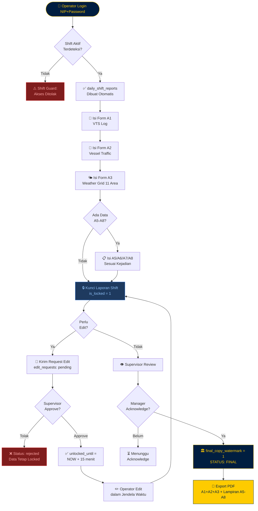
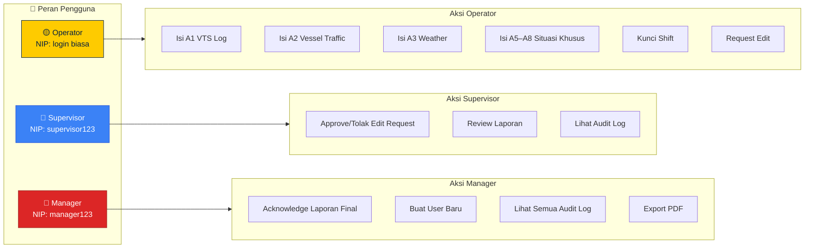
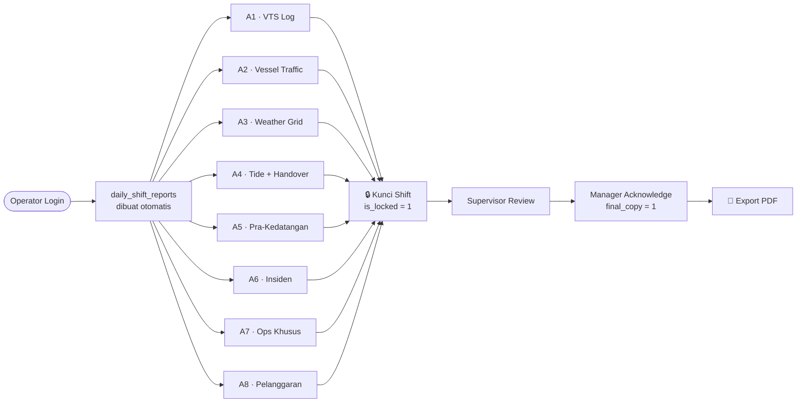
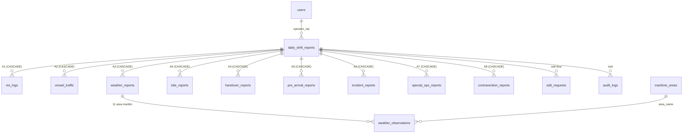

<div align="center">

# 🚢 VTS OPS-LOG Palembang

**Sistem Pencatatan Operasional Harian Vessel Traffic Service**

[](https://php.net)
[](https://mysql.com)
[](https://github.com/dompdf/dompdf)
[](.)
[](.)

> Sistem manajemen operasi maritim berbasis web untuk **VTS Palembang** — Distrik Navigasi Type B, Direktorat Jenderal Perhubungan Laut.  
> Mencakup formulir SOP **A1–A8**, manajemen shift, kontrol akses **RBAC**, audit trail penuh, dan ekspor **PDF** laporan shift.

[📖 Panduan Pengguna](PANDUAN_PENGGUNA.md) · [🗄️ Skema Database](sql/schema.sql) · [🎨 Desain UI](DESAIN.MD)

</div>

---

## Roadmap Implementasi

| Phase | Fokus | Status |
|-------|-------|--------|
| Phase 1 | Skema database SOP A1–A8 + integrity flags (`is_locked`, `edit_requested`, FK cascade) | ✅ Selesai |
| Phase 2 | Login NIP/password Argon2id + pencatatan kehadiran otomatis + shift guard | ✅ Selesai |
| Phase 3 | Single-page multi-tab A1–A3 + weather grid 11 wilayah + dynamic A2 rows + FAB situasi khusus | ✅ Selesai |
| Phase 4 | Lock laporan shift, alur request edit, supervisor grant akses sementara 15 menit | ✅ Selesai |
| Phase 5 | Detail form A5–A8: Pra-Kedatangan, Laporan Insiden, Ops Khusus, Pelanggaran Berlayar | 🔄 In Progress |
| Phase 6 | Export PDF gabungan A1–A3 + lampiran A5–A8 menggunakan Dompdf | 🔄 In Progress |
| Refactor Security | Argon2id, session regeneration, RBAC folder isolation, CSRF per-form | ✅ Selesai |

---

## Arsitektur Sistem

```mermaid
graph TB
    subgraph CLIENT["🌐 Browser Client"]
        LOGIN["🔐 Login Page<br/>/public/index.php"]
        DASH_OP["📋 Dashboard Operator<br/>A1 · A2 · A3 · A5-A8"]
        DASH_SUP["🔍 Dashboard Supervisor<br/>Edit Request · Audit"]
        DASH_MGR["🏛️ Dashboard Manager<br/>Acknowledge · User Mgmt"]
    end

    subgraph CORE["⚙️ Core Engine"]
        APP["config/app.php<br/>BASE_URL · CSRF · Session"]
        HELPER["config/helpers.php<br/>Shift Guard · Edit Access"]
        MW["middleware.php<br/>requireRole()"]
    end

    subgraph ACTIONS["🔄 Action Handlers (POST)"]
        AUTH["auth/login_process"]
        VTS["operator/vts_log_store"]
        VESSEL["operator/vessel_traffic_store"]
        WEATHER["operator/weather_store"]
        LOCK["operator/lock_shift_report"]
        REQEDIT["operator/request_edit"]
        SPECIAL["operator/special_report_store"]
        GRANT["supervisor/grant_edit"]
        ACK["manager/acknowledge"]
    end

    subgraph DB["🗄️ MySQL Database (vts_ops_log)"]
        DAILY["daily_shift_reports"]
        VTS_LOG["vts_logs (A1)"]
        VESSEL_T["vessel_traffic (A2)"]
        WEATHER_R["weather_reports (A3)"]
        TIDE["tide_reports (A4)"]
        PRE["pre_arrival_reports (A5)"]
        INCIDENT["incident_reports (A6)"]
        SPECIAL_OPS["special_ops_reports (A7)"]
        CONTRA["contravention_reports (A8)"]
        EDIT_REQ["edit_requests"]
        AUDIT["audit_logs"]
        USERS["users"]
    end

    subgraph OUTPUT["📄 Output"]
        PDF["export_pdf.php<br/>Dompdf A2 Landscape"]
    end

    LOGIN --> AUTH --> DAILY
    DAILY --> VTS_LOG & VESSEL_T & WEATHER_R & TIDE
    DAILY --> PRE & INCIDENT & SPECIAL_OPS & CONTRA
    LOCK --> DAILY
    REQEDIT --> EDIT_REQ --> GRANT
    ACK --> DAILY
    DAILY --> PDF
    APP & HELPER & MW --> ACTIONS
    USERS --> AUTH
    ACTIONS --> AUDIT
```



---

## Alur Kerja Shift (Flowchart)



---

## Alur RBAC & Hak Akses



---

## Formulir SOP A1–A8

Setiap formulir terikat ke `daily_shift_reports` via `daily_shift_report_id` (FK cascade). Semua tabel memiliki kolom `is_locked` dan `edit_requested` untuk kontrol integritas.

### A1 — VTS Log (`vts_logs`)
Catatan kronologis aktivitas komunikasi dan pemantauan kapal selama shift.

| Kolom | Tipe | Keterangan |
|-------|------|------------|
| `log_time` | DATETIME | Waktu kejadian/komunikasi dicatat |
| `vessel_name` | VARCHAR(120) | Nama kapal yang terlibat |
| `call_sign` | VARCHAR(50) | Tanda panggil radio kapal |
| `activity` | VARCHAR(180) | Jenis aktivitas (wajib isi) |
| `location` | VARCHAR(160) | Posisi atau koordinat kapal |
| `notes` | TEXT | Catatan tambahan operator |
| `status` | VARCHAR(60) | Status transaksi (misal: aman, tertunda) |

### A2 — Lalu Lintas Kapal (`vessel_traffic`)
Data pergerakan kapal masuk/keluar/transit secara multi-baris, dapat ditambah dinamis tanpa reload halaman.

| Kolom | Tipe | Keterangan |
|-------|------|------------|
| `vessel_name` | VARCHAR(120) | Nama kapal |
| `call_sign` | VARCHAR(50) | Tanda panggil |
| `last_port` | VARCHAR(120) | Pelabuhan asal |
| `next_port` | VARCHAR(120) | Pelabuhan tujuan |
| `etd` | DATETIME | Estimated Time of Departure |
| `eta` | DATETIME | Estimated Time of Arrival |
| `alongside_time` | DATETIME | Waktu sandar |
| `anchor_time` | DATETIME | Waktu lego jangkar |
| `depart_time` | DATETIME | Waktu berangkat aktual |
| `vessel_type` | VARCHAR(80) | Jenis kapal (tanker, kontainer, dll.) |
| `agent` | VARCHAR(120) | Agen pelayaran |
| `direction` | ENUM | `inbound` / `outbound` / `transit` |
| `remarks` | TEXT | Keterangan tambahan |

### A3 — Laporan Cuaca (`weather_reports` + `weather_observations`)
Satu record `weather_reports` per shift, dikaitkan dengan 11 area maritim di `weather_observations`.

| Kolom (`weather_observations`) | Tipe | Keterangan |
|--------------------------------|------|------------|
| `area_name` | VARCHAR(120) | Nama area (FK ke `maritime_areas`) |
| `weather_condition` | ENUM | Cerah / Berawan / Hujan Ringan / Hujan Lebat / Badai |
| `wind_direction` | VARCHAR(20) | Arah angin (misal: NE, SW) |
| `wind_speed_knots` | DECIMAL(5,2) | Kecepatan angin dalam knot |
| `wave_height_m` | DECIMAL(4,2) | Tinggi gelombang dalam meter |
| `wave_category` | ENUM | Tenang / Rendah / Sedang / Tinggi / Sangat Tinggi |

### A4 — Pasang Surut & Serah Terima Shift

**Tabel `tide_reports`** — Data pasang surut per shift:

| Kolom | Keterangan |
|-------|------------|
| `highest_tide_value_m` / `highest_tide_time` | Nilai dan waktu air tertinggi |
| `lowest_tide_value_m` / `lowest_tide_time` | Nilai dan waktu air terendah |
| `current_water_level_m` | Level air saat pencatatan |
| `warnings` | Peringatan khusus pasang surut |

**Tabel `handover_reports`** — Ringkasan serah terima antar shift:

| Kolom | Keterangan |
|-------|------------|
| `ships_in_count` | Jumlah kapal masuk selama shift |
| `ships_out_count` | Jumlah kapal keluar selama shift |
| `ships_transit_count` | Jumlah kapal transit |
| `ships_anchor_count` | Jumlah kapal berlabuh jangkar |
| `equipment_status` | Status peralatan VTS (radar, AIS, radio) |
| `ntm_notes` | Notice to Mariners — pengumuman penting navigasi |
| `summary_notes` | Catatan ringkas shift untuk penerima giliran berikutnya |

---

### A5 — Pra-Kedatangan (`pre_arrival_reports`)
Formulir pemberitahuan kapal yang akan tiba, diisi sebelum kapal masuk area VTS.

| Kolom | Tipe | Keterangan |
|-------|------|------------|
| `vessel_name` | VARCHAR(120) | Nama kapal |
| `imo_number` | VARCHAR(30) | Nomor IMO (identifikasi internasional kapal) |
| `gross_tonnage` | DECIMAL(10,2) | Tonase kotor kapal dalam GT |
| `loa_m` | DECIMAL(8,2) | Length Overall — panjang total kapal dalam meter |
| `draft_m` | DECIMAL(6,2) | Sarat kapal (kedalaman lambung terbenam) dalam meter |
| `pob_count` | INT | Jumlah Person on Board (awak + penumpang) |
| `expected_arrival` | DATETIME | ETA kapal memasuki area VTS |
| `cargo_details` | TEXT | Rincian muatan (jenis, berat, kode B3 jika ada) |
| `special_notes` | TEXT | Catatan khusus: kondisi darurat, kebutuhan pilot, dll. |

> Digunakan untuk mempersiapkan navigasi, koordinasi pilot, dan kontrol selat sebelum kapal tiba.

---

### A6 — Laporan Insiden (`incident_reports`)
Pencatatan kejadian tidak normal: kecelakaan, kandas, tabrakan, pencemaran, SAR, dll.

| Kolom | Tipe | Keterangan |
|-------|------|------------|
| `incident_datetime` | DATETIME | Waktu insiden terjadi |
| `title` | VARCHAR(160) | Judul singkat insiden |
| `chronology` | LONGTEXT | Kronologi lengkap kejadian |
| `deaths_count` | INT | Jumlah korban jiwa |
| `missing_count` | INT | Jumlah orang hilang |
| `pollution_location` | VARCHAR(160) | Lokasi pencemaran (jika ada tumpahan minyak/B3) |
| `authorities_notified` | JSON | Daftar instansi yang dihubungi: `["KSOP", "Basarnas", "KLHK"]` |
| `immediate_action` | LONGTEXT | Tindakan segera yang dilakukan VTS/kapal |

> Setiap insiden yang dicatat wajib dilaporkan ke rantai komando dan disertakan dalam lampiran PDF laporan shift.

---

### A7 — Operasi Khusus (`special_ops_reports`)
Pencatatan operasi non-rutin yang melibatkan aset TNI AL, Bakamla, Polair, latihan bersama, atau operasi SAR.

| Kolom | Tipe | Keterangan |
|-------|------|------------|
| `operation_name` | VARCHAR(160) | Nama/kode operasi |
| `operation_start` | DATETIME | Waktu mulai operasi |
| `operation_end` | DATETIME | Waktu selesai (nullable jika masih berlangsung) |
| `location` | VARCHAR(160) | Area operasi (koordinat atau nama perairan) |
| `operation_details` | LONGTEXT | Deskripsi lengkap: tujuan, aset yang terlibat, prosedur |
| `outcome_notes` | LONGTEXT | Hasil operasi: pencapaian, temuan, eskalasi |

> Satu shift dapat memiliki lebih dari satu record operasi khusus.

---

### A8 — Pelanggaran Berlayar (`contravention_reports`)
Pencatatan pelanggaran aturan berlayar oleh kapal di wilayah pengawasan VTS.

| Kolom | Tipe | Keterangan |
|-------|------|------------|
| `vessel_name` | VARCHAR(120) | Nama kapal pelanggar |
| `violation_type` | VARCHAR(120) | Jenis pelanggaran (misal: melintas tanpa izin, kecepatan berlebih) |
| `violation_datetime` | DATETIME | Waktu dan tanggal pelanggaran |
| `location` | VARCHAR(160) | Lokasi kejadian pelanggaran |
| `warning_type` | VARCHAR(120) | Jenis teguran: peringatan lisan, tertulis, laporan ke KSOP |
| `action_taken` | LONGTEXT | Uraian lengkap tindakan yang diambil oleh VTS |
| `legal_reference` | VARCHAR(120) | Dasar hukum (misal: PM 57/2015 Pasal 12 ayat 3) |

> Digunakan sebagai dasar pelaporan ke KSOP dan dokumentasi kepatuhan pelayaran.

---

## Alur Kerja Sistem



---

## Struktur File Proyek

### Konfigurasi & Core
| File | Fungsi |
|------|--------|
| `sql/schema.sql` | Skema MySQL lengkap: semua tabel, FK, index, constraint |
| `sql/migration_phase3_phase4.sql` | Migrasi incremental untuk database existing |
| `sql/fk_cascade_check.sql` | Query verifikasi integritas FK di database aktif |
| `config/database.php` | Koneksi PDO singleton via `getPdo()`, baca dari `.env` |
| `config/app.php` | Konstanta `BASE_PATH`, `BASE_APP`, `BASE_URL`; fungsi `csrfToken()`, `redirect()` |
| `config/helpers.php` | Helper: deteksi shift aktif, guard shift, pencatatan audit |
| `middleware.php` | Role guard: `requireRole($role)`, `requireAnyRole([...])` |

### Public Entry Points
| File | Fungsi |
|------|--------|
| `public/index.php` | Halaman login (form NIP + password) |
| `public/dashboard.php` | Router: redirect ke view sesuai role setelah login |
| `public/export_pdf.php` | Generate dan stream PDF laporan shift via Dompdf |
| `public/logout.php` | Hapus session + redirect ke login |

### Views
| File | Fungsi |
|------|--------|
| `views/operator/dashboard.php` | Dashboard operator: tab A1/A2/A3, timer shift, FAB situasi khusus |
| `views/supervisor/dashboard.php` | Dashboard supervisor: tabel pending edit request, tombol approve |
| `views/manager/manager_approval.php` | Dashboard manager: tabel laporan terkunci, form acknowledge, buat user |
| `views/supervisor/audit_logs.php` | Riwayat audit seluruh aksi dalam sistem (view supervisor) |
| `views/manager/audit_logs.php` | Riwayat audit lengkap (view manager) |
| `views/partials/layout.php` | Template dasar: head, sidebar, navbar |

### Actions (POST handlers)
| File | Fungsi |
|------|--------|
| `actions/auth/login_process.php` | Verifikasi NIP+password Argon2id, catat kehadiran, regenerate session |
| `actions/operator/vts_log_store.php` | Simpan baris A1 VTS Log |
| `actions/operator/vessel_traffic_store.php` | Simpan multi-baris A2 dengan guard shift+lock |
| `actions/operator/weather_store.php` | Simpan grid A3 (11 wilayah maritim) |
| `actions/operator/lock_shift_report.php` | Kunci laporan shift (`is_locked = 1`) |
| `actions/operator/request_edit.php` | Kirim permintaan edit ke supervisor |
| `actions/operator/special_report_store.php` | Simpan data A5–A8 |
| `actions/supervisor/grant_edit.php` | Approve edit request + set `unlocked_until` |
| `actions/manager/acknowledge.php` | Manager finalisasi (`final_copy_watermark = 1`) |
| `actions/manager/create_user.php` | Buat akun operator/supervisor baru dengan Argon2id |

---

## Cara Menjalankan

### Prasyarat
- XAMPP 8.1+ atau stack setara dengan Apache, PHP, dan MySQL/MariaDB
- PHP >= 8.1 dengan ekstensi `pdo_mysql`, `mbstring`, `fileinfo`, `zip`, dan `sodium`
- MySQL 8.0+ atau MariaDB 10.6+
- Composer 2.x
- Git untuk versioning dan deployment ke GitHub

> Rekomendasi developer: gunakan `composer install`, simpan konfigurasi rahasia di `.env`, dan jangan commit folder `vendor/`, file log runtime, atau credential produksi.

### Langkah Setup

Gunakan alur berikut untuk setup developer yang rapi di XAMPP:

1. **Clone / salin project ke workspace XAMPP:**
   ```powershell
   cd C:\xampp\htdocs
   git clone <URL_REPOSITORY_GITHUB> VTS-OPS-LOG
   cd VTS-OPS-LOG
   ```

   Jika belum memakai GitHub, salin folder project ke:
   ```text
   C:\xampp\htdocs\VTS-OPS-LOG
   ```

2. **Install dependency PHP:**
   ```bash
   composer install
   ```

3. **Konfigurasi koneksi** - salin `.env.example` menjadi `.env`, lalu sesuaikan:
   ```env
   DB_HOST=127.0.0.1
   DB_PORT=3306
   DB_NAME=vts_ops_log
   DB_USER=root
   DB_PASS=
   APP_ENV=local
   ```

4. **Buat database dan import skema:**
   ```bash
   mysql -u root -p < sql/schema.sql
   mysql -u root -p vts_ops_log < sql/migration_phase3_phase4.sql
   ```

5. **Jalankan server lokal untuk development:**
   ```bash
   php -S localhost:8000 -t public
   ```

6. **Atau jalankan via Apache XAMPP:**
   - Buka XAMPP Control Panel
   - Start `Apache` dan `MySQL`
   - Pastikan `mod_rewrite` aktif
   - Akses aplikasi melalui `http://localhost/VTS-OPS-LOG/public/`

7. **Buka aplikasi:**
   ```text
   http://localhost:8000/index.php
   ```

### Virtual Host XAMPP (Opsional)

Untuk URL yang lebih bersih saat development, arahkan Apache langsung ke folder `public`:

```apache
<VirtualHost *:80>
    ServerName vts-ops-log.local
    DocumentRoot "C:/xampp/htdocs/VTS-OPS-LOG/public"

    <Directory "C:/xampp/htdocs/VTS-OPS-LOG/public">
        AllowOverride All
        Require all granted
    </Directory>
</VirtualHost>
```

Tambahkan juga ke file `hosts` Windows:

```text
127.0.0.1 vts-ops-log.local
```

Lalu akses `http://vts-ops-log.local/`.

### Langkah Setup Alternatif

1. **Import database:**
   ```bash
   # Fresh install (reset semua data):
   mysql -u root -p < sql/schema.sql

   # Upgrade database existing (tanpa hapus data):
   mysql -u root -p vts_ops_log < sql/migration_phase3_phase4.sql
   ```

2. **Konfigurasi koneksi** — buat file `.env` di root project:
   ```env
   DB_HOST=127.0.0.1
   DB_PORT=3306
   DB_NAME=vts_ops_log
   DB_USER=root
   DB_PASS=
   ```

3. **Install Dompdf untuk PDF export:**
   ```bash
   composer install
   # Jika belum ada composer.lock:
   composer require dompdf/dompdf
   ```

4. **Jalankan server lokal:**
   ```bash
   # Dari direktori root project
   php -S localhost:8000 -t public
   ```

5. **Buka di browser:**
   ```
   http://localhost:8000/index.php
   ```

---

## Akun Default (dari `schema.sql`)

| Role | NIP | Password |
|------|-----|----------|
| Supervisor | `198001010001` | `Supervisor123` |
| Manager | `197901020001` | `Manager123` |
| Operator (Tim A) | `199001030001` | `Operator123` |

> Password tersimpan dalam hash Argon2id. Untuk akun baru, gunakan form **Buat User** di dashboard Manager.

---

## Aturan Shift Guard

| Shift | Jam Aktif | Tanggal Operasional |
|-------|-----------|---------------------|
| Pagi | 08:00 – 13:59 | Tanggal hari ini |
| Siang | 14:00 – 19:59 | Tanggal hari ini |
| Malam | 20:00 – 07:59 (esok) | Tanggal hari ini (pre-midnight) / kemarin (post-midnight) |

- Operator hanya dapat menulis data selama shift aktif yang sama saat login.
- Jam 00:00–07:59 dianggap bagian dari shift malam tanggal operasional **sebelumnya**.
- Data yang ditulis di luar window shift akan ditolak oleh action handler.

---

## Alur Lock & Edit Request

```mermaid
sequenceDiagram
    actor OP as Operator
    actor SUP as Supervisor
    actor MGR as Manager
    participant DB as Database

    OP->>DB: Kunci Shift (is_locked = 1)
    DB-->>OP: ✅ Semua form dinonaktifkan

    OP->>DB: Minta Edit (alasan wajib diisi)
    DB-->>SUP: ⚡ edit_requests: status = 'pending'

    alt Supervisor Approve
        SUP->>DB: Grant Edit Access
        DB-->>OP: ✅ unlocked_until = NOW() + 15 menit
        OP->>DB: Edit data dalam jendela waktu
        DB-->>OP: ✏️ Data tersimpan
    else Supervisor Tolak
        SUP->>DB: Reject Request
        DB-->>OP: ❌ status = 'rejected', data tetap terkunci
    end

    MGR->>DB: Acknowledge Laporan
    DB-->>MGR: 🏛️ final_copy_watermark = 1 (PERMANEN)
    Note over DB: Seluruh transisi dicatat di audit_logs
```



---

## Catatan PDF Engine

- Tombol **Cetak PDF** hanya aktif jika `is_locked = 1` pada shift report.
- Halaman 1–3: Formulir A1 (VTS Log), A2 (Vessel Traffic), A3 (Weather Grid).
- Halaman berikutnya (lampiran otomatis): A5–A8 jika ada data yang diisi pada shift tersebut.
- Tanda tangan supervisor dan manager ditarik dari `users.full_name` pada shift terkait.
- Fallback nama tanda tangan: `Ria Irawan, S.Pd` (supervisor) dan `Merry D. Anitasari` (manager).

---

## Security Notes

| Mekanisme | Detail |
|-----------|--------|
| **Password hashing** | `password_hash(..., PASSWORD_ARGON2ID)` — tahan GPU brute-force |
| **Verifikasi login** | `password_verify()` — constant-time comparison |
| **Session hijacking** | `session_regenerate_id(true)` setiap login berhasil |
| **CSRF protection** | Token per-form via `csrfToken()`, diverifikasi `verifyCsrfOrDie()` |
| **RBAC isolation** | Middleware `requireRole()` di setiap action; view folder terpisah per role |
| **SQL injection** | Semua query menggunakan PDO prepared statements |
| **Input validation** | Validasi tipe dan panjang di action handler sebelum INSERT/UPDATE |

---

## Integritas Foreign Key

Semua tabel A1–A8 menggunakan `ON DELETE CASCADE` ke `daily_shift_reports`. Artinya jika satu laporan shift dihapus (hanya bisa dilakukan langsung di DB oleh admin), seluruh data A1–A8 terkait ikut terhapus secara otomatis.



Untuk verifikasi FK di database aktif:
```bash
mysql -u root -p vts_ops_log < sql/fk_cascade_check.sql
```

---

## Panduan Pengguna

Untuk panduan penggunaan lengkap per peran (Operator, Supervisor, Manager), lihat:

👉 **[PANDUAN_PENGGUNA.md](PANDUAN_PENGGUNA.md)**

---

<div align="center">

**VTS Palembang** · Distrik Navigasi Type B · Direktorat Jenderal Perhubungan Laut  
*Sistem ini hanya untuk penggunaan internal personel VTS Palembang yang berwenang.*

</div>
